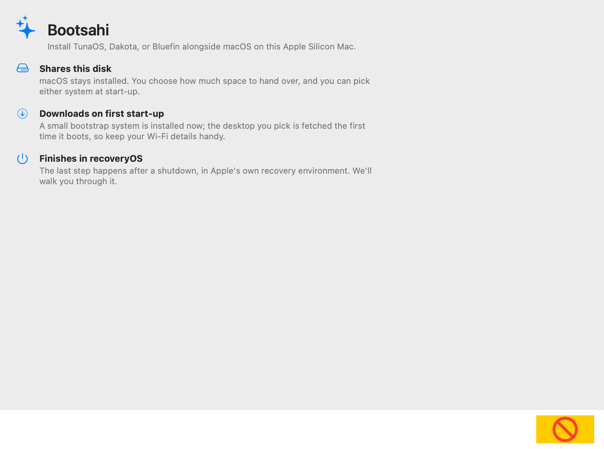

# bootc-installer-asahi

The Apple Silicon (Asahi Linux) installer path for TunaOS-family bootc images
— and anyone else's (Dakota, Bluefin, Bazzite): a macOS-driven install flow
for M1/M2 Macs.

  

  <em>Every frame is rendered in CI from the real SwiftUI views — see the
  <a href="docs/gui-walkthrough.md">step-by-step walkthrough</a>.</em>

**Architecture** (see [docs/DESIGN.md](docs/DESIGN.md)): instead of one
installer payload per variant×desktop, we ship **one minimal bootstrap
payload** whose first boot runs [fisherman](https://github.com/projectbluefin/fisherman)
to `bootc install` the image ref the user picked in the macOS app. The catalog
is just registry refs (`bonito:gnome-asahi`, …), so a new variant needs no
installer change — but a ref **must** pass the Asahi golden-manifest harness
before it is offered, and "appears without touching the installer" must never
be read as "appears without being verified."

As of 2026-07-30 only `bonito` and `grouper` pass (36/36 each); the other six
promoted `*-asahi` tags would leave a Mac unbootable
([tunaOS#776](https://github.com/tuna-os/tunaOS/issues/776)). Today's shipped
`catalog.json` is a placeholder holding one hand-written entry — `bonito`,
which is verified — so nothing unbootable is currently offered. The hazard is
in the generator DESIGN.md calls for: enumerating `*-asahi` tags from
registry-map.yaml would pull in all six. That gate is
[#41](https://github.com/tuna-os/bootc-installer-asahi/issues/41).

## Status

- [x] Design (docs/DESIGN.md)
- [x] D0 scaffold: `scripts/make-payload.sh` + `build-payload.yml` — package
      any asahi-capable bootc image as an asahi-installer zip +
      `installer_data.json` (artifact-only; R2 upload TODO)
- [ ] D0 validated against a real asahi image (`bonito:gnome-asahi`, tunaOS#774)
- [ ] D1 first-boot fisherman agent config (`install-config.json` → unattended `bootc install`)
- [ ] D2 asahi-installer `--json` machine mode (upstreamable)
- [ ] D3 macOS app (SwiftUI, wraps the asahi-installer Python backend)
- [ ] D4 recoveryOS walkthrough UX, LUKS, Wi-Fi handoff

Payload layout & `installer_data.json` schema modeled on
fedora-asahi kiwi-descriptions and
[nixos-asahi-package](https://github.com/quinneden/nixos-asahi-package).
M1/M2 only — M3+ has no Asahi installer support yet.
